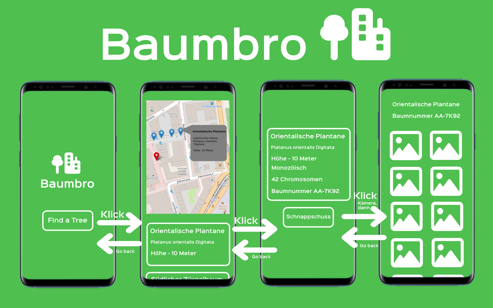
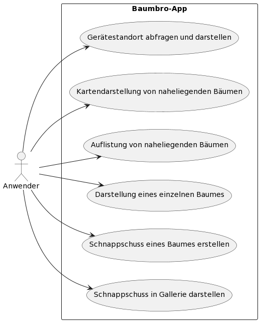
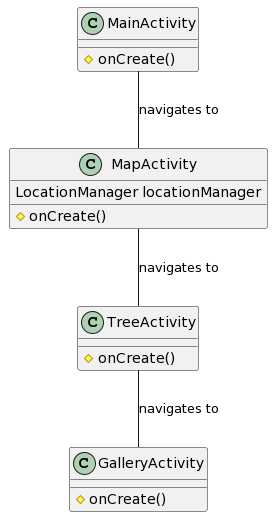

# baumbro_android

An Android Java project for the course UeK 335

## Planung

### Storyboard

## Technischer Entwurf

### Anforderungsanalyse

#### Spezifikation der Anforderungen
Um meine Anwendungsfälle zu definieren, werde ich die Anforderungen in funktionale und nicht funktionale Anforderungen gliedern.

| Typ | Beschreibung |
| --- | --- |
| FR | Anforderungen an das System um die Bedürfnisse des Benutzers zu erfüllen. |
| NFR | Anforderungen an Qualitäten, Eigenschaften und Einschränkungen des Systems. |

#### Akteur
Der Anwender dieser Applikation ist alltäglicher Anwender von Mobiltelefonen, aber kein IT-Spezialist. Er möchte Informationen zu Bäumen in seiner Umgebung aufrufen.

#### Funktionale Anforderungen

| Titel                                    | ID   | Akteur                           | Anforderung                                                          | Akzeptanzkriterien                                                                                       |
|------------------------------------------|------|----------------------------------|----------------------------------------------------------------------|----------------------------------------------------------------------------------------------------------|
| Abfrage und Darstellung des Gerätestandorts | FR-1 | Anwender der Baumbro-Applikation | Der Gerätestandort wird abgefragt und dargestellt.                  | Der Gerätestandort wird in der View der zweiten Aktivität in der Kartenansicht am richtigen Ort dargestellt. |
| Kartendarstellung von naheliegenden Bäumen | FR-2 | Anwender der Baumbro-Applikation | Bäume, die sich in der Nähe des Anwenders befinden, werden auf der Karte angezeigt. | Bäume, die sich innerhalb einer festgelegten Distanz vom Gerätestandort befinden, werden in der Kartenansicht als "Pins" dargestellt. |
| Auflistung von naheliegenden Bäumen     | FR-3 | Anwender der Baumbro-Applikation | Bäume, die sich in der Nähe des Anwenders befinden, werden angezeigt. | Bäume, die sich innerhalb einer festgelegten Distanz vom Gerätestandort befinden, werden unterhalb der Kartenansicht aufgelistet. |
| Darstellung eines einzelnen Baumes      | FR-4 | Anwender der Baumbro-Applikation | In einer Show-View werden Details zu einem Baum gezeigt.             | In einer dritten View wird der ausgewählte Baum mit detaillierten Informationen angezeigt.                |
| Schnappschuss eines Baumes erstellen    | FR-5 | Anwender der Baumbro-Applikation | Der "Schnappschuss"-Knopf auf der Show-Seite öffnet die Kamera.      | Beim Klick auf den "Schnappschuss"-Knopf auf der Show-Seite wird ein Kamera-Intent ausgelöst.             |
| Schnappschuss in Galerie dargestellt    | FR-6 | Anwender der Baumbro-Applikation | Der Schnappschuss des Baumes wird in einer Galerieansicht gezeigt.   | In einer View für einen einzelnen Baum wird der getätigte Schnappschuss in einer Galerieansicht dargestellt. |

#### Nicht-Funktionale Anforderungen

| Titel                                    | ID   | Anforderung                           | Akzeptanzkriterien                                                                           |
|------------------------------------------|------|---------------------------------------|----------------------------------------------------------------------------------------------|
| UI im Storyboard-Design                  | NFR-1| Das UI entspricht der Designsprache, die im Storyboard erfasst wurde.                     | Das UI entspricht der Designsprache des Storyboards: Grün und minimalistisch.                |
| Performante Datenbankabfragen            | NFR-2| Datenbankabfragen sollten performant sein.                                               | Die App sollte die Datenbankabfragen für die Kartenansicht innerhalb von 0.5 Sekunden tätigen. |
| Schneller Fluss zwischen Views           | NFR-3| Der Wechsel zwischen den Views sollte schnell sein.                                       | Das Laden einer View sollte nie länger als eine Sekunde dauern.                                |

### Anwendungsfalldiagramm

### Testen

Aus Zeit- und Komplexitätsgründen, beschränken wir uns auf manuelle Tests und es werden keine Unit-Tests geschrieben. 
Die Tests werden auf einem emulierten Gerät im IDE Android Studio ausgeführt.

#### Testumgebung
| Gerät | Pixel 4 (emuliert) |
| --- | --- |
| Bildschirmauflösung | 1020x2280 440dpi |
| Android-Version | Android 14.0 arm64-v8a |
| Entwicklungsumgebung | Android Studio Iguana | 2023.2.1 |

#### Testfälle

##### Testfall T-1
| Titel | Knopf *Find a Tree* ruft Kartenasicht-View auf |
| --- | --- |
| ID | T-1 |
| Voraussetzungen | App gestartet und Berechtigungen für Standort gegeben. |
| Durchführung | Es wird auf den *Find a Tree*-Knopf in der ersten View geklickt. |
| Erwartetes Resultat | Kartenansicht wird in einer zweiten View gezeigt. |

##### Testfall T-2
| Titel | Kartenansicht zeigt korrekter Standort an. |
| --- | --- |
| ID | T-2 |
| Voraussetzungen | App gestartet, Berechtigungen für Standort gegeben. |
| Durchführung | Es wird auf den *Find a Tree*-Knopf in der ersten View geklickt. |
| Erwartetes Resultat | Kartenansicht in der zweiten View zeigt mit einem Pin den korrekten Standort an. |

##### Testfall T-3
| Titel | Kartenansicht zeigt umliegende Bäume mit Pins. |
| --- | --- |
| ID | T-3 |
| Voraussetzungen | App gestartet, Berechtigungen für Standort gegeben. |
| Durchführung | Es wird auf den *Find a Tree*-Knopf in der ersten View geklickt. |
| Erwartetes Resultat | Kartenansicht in der zweiten View zeigt umliegende Bäume mit Pins markiert. |

##### Testfall T-4
| Titel | Kartenansicht zeigt umliegende Bäume aufgelistet. |
| --- | --- |
| ID | T-4 |
| Voraussetzungen | App gestartet, Berechtigungen für Standort gegeben. |
| Durchführung | Es wird auf den *Find a Tree*-Knopf in der ersten View geklickt. |
| Erwartetes Resultat | Unterhalb der Kartenansicht in der ersten View werden die umliegenden Bäume mit ihren Eigenschaften in einer Listenansicht angezeigt. |

##### Testfall T-5
| Titel | Listeneinträge führen zu Show-Seite. |
| --- | --- |
| ID | T-5 |
| Voraussetzungen | App gestartet, Berechtigungen für Standort gegeben, *Find a Tree*-Knopf geklickt. |
| Durchführung | Es wird auf einen Listeneintrag eines Baumes geklickt. |
| Erwartetes Resultat | Wir werden zu einer View geführt, die Details zum angeklickten Baum sowie einen "Schnappschuss"-Knopf anzeigt. |

##### Testfall T-6
| Titel | "Schnappschuss"-Knopf öffnet Kamera-App. |
| --- | --- |
| ID | T-6 |
| Voraussetzungen | App gestartet, Berechtigungen für Standort gegeben, *Find a Tree*-Knopf geklickt, Listeneintrag eines Baumes geklickt. |
| Durchführung | Es wird auf den "Schnappschuss"-Knopf in der Show-View geklickt. |
| Erwartetes Resultat | Eine Kamera-Intent wird ausgeführt und die Kamera wird geöffnet. |

##### Testfall T-7
| Titel | Schnappschuss wird in Galerie gezeigt. |
| --- | --- |
| ID | T-7 |
| Voraussetzungen | App gestartet, Berechtigungen für Standort gegeben, *Find a Tree*-Knopf geklickt, Listeneintrag eines Baumes geklickt, "Schnappschuss"-Knopf geklickt. |
| Durchführung | Der Schnappschuss wird getätigt und das Bild akzeptiert. |
| Erwartetes Resultat | Der Schnappschuss wird in einer View in einer Galerieansicht für den ausgewählten Baum angezeigt. |

### Systemaufbau

#### Klassendiagramm

